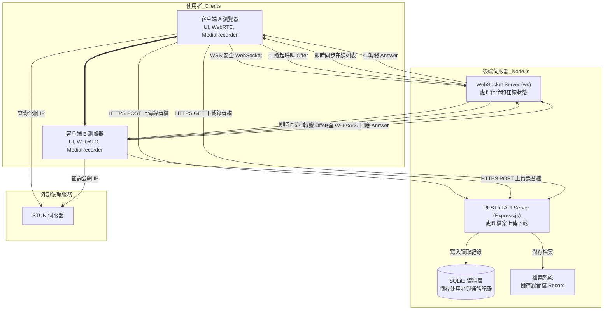

好的，身為資深軟體工程師，我已經幫您審閱並修改了這份產品規格書。主要的修改是將後端技術棧從 Golang 全面轉換為 Node.js，並在相關章節提供了更符合 Node.js 生態系的建議。

以下是修訂後的「安心聊」產品規格說明書：

---

## 安心聊 - 產品規格說明書 (PRD)

**專案名稱：** 安心聊
**版本：** 1.2 (Node.js 修訂版)
**日期：** 2025年8月11日

### **1. 專案概述**

安心聊是一個基於網頁的簡單語音通訊應用程式 (因需支援麥克風，故採用 HTTPS 安全連線)。使用者可以透過網頁瀏覽器進行即時語音通話及語音檔案的錄製與下載。此系統旨在提供一個簡單易用的語音通訊 Demo，用以驗證 WebRTC 技術的可行性及相關功能。目標使用者為軟體工程師及對 WebRTC 技術感興趣的開發者。

### **2. 核心功能**

*   **語音通話:** 使用者可以透過系統進行即時語音通話。
    *   **重要性:** 這是系統的核心功能，提供主要的使用者價值。
    *   **運作方式:** 利用 WebRTC 技術實現瀏覽器間的點對點 (Peer-to-Peer) 音訊串流，後端伺服器作為信令 (Signaling) 伺服器，協助建立連線。

*   **語音錄製:** 系統支援在通話過程中錄製語音內容。
    *   **重要性:** 提供通話記錄功能，方便使用者日後查閱。
    *   **運作方式:** **錄音功能在前端瀏覽器中透過 `MediaRecorder` Web API 完成**。通話結束後，由前端將錄製好的音訊檔案上傳至後端伺服器。

*   **語音下載:** 使用者可以下載已錄製的語音檔案。
    *   **重要性:** 方便使用者離線存取通話記錄。
    *   **運作方式:** 使用者透過網頁介面請求下載儲存於伺服器上的 WAV 格式錄音檔案。

*   **使用者管理:** 系統即時管理線上使用者狀態。
    *   **重要性:** 確保通話對象的可用性及即時狀態更新。
    *   **運作方式:** 後端伺服器利用 WebSocket 技術追蹤已連線的使用者狀態，並主動將線上列表推送給所有客戶端。

### **3. 使用者體驗**

*   **使用者角色:** 軟體工程師、WebRTC 技術愛好者。
*   **主要使用者流程:**
    1.  使用者輸入自己的名稱。
    2.  按下 **「連線」** 按鈕，與後端 WebSocket 伺服器建立連線。
    3.  連線成功後，**伺服器會自動將當前的線上使用者列表推送至前端**，並更新「選擇聯絡人」的下拉式選單。**「同步資料」** 按鈕可作為手動刷新列表的備用選項。
    4.  使用者從下拉選單中選擇一位聯絡人。
    5.  按下 **「通話」** 按鈕發起呼叫。對方會收到來電通知（顯示來電者名稱），並可選擇 **「接聽」** 或 **「掛掉」**。
    6.  通話過程中，雙方的瀏覽器都會使用 Web API 進行語音側錄。
    7.  通話結束後，**雙方瀏覽器皆會嘗試將錄音檔上傳至伺服器**。伺服器會根據通話的唯一識別碼，只儲存第一個成功上傳的檔案，以確保每通對話只會保留一份錄音，同時也避免因單一使用者上傳失敗而導致錄音遺失。
    8.  使用者可點擊 **「下載」** 按鈕，頁面將跳轉至語音下載頁面。
    9.  在語音下載頁面，使用者可以檢視歷史通話紀錄並下載對應的錄音檔案。
*   **UI/UX 考量:** 通話介面參考 `mobile-ui.png`，伺服器端監控中心介面參考 `server-ui.png`。

### **4. 技術架構**

*   **系統組件:** 前端網頁應用程式 (Client UI), 後端伺服器 (Server)。
*   **資料模型:** 詳見第 10 節「資料庫設計」。
*   **API 與整合:**
    *   **RESTful API:** 用於處理使用者資訊、語音檔案列表查詢與下載請求。
    *   **WebSocket:** 用於 WebRTC 信令傳輸及即時使用者狀態同步。
*   **基礎設施需求:**
    *   伺服器: 需安裝 **Node.js** 及套件管理器 (npm 或 yarn)，並安裝相關框架與套件 (例如 **Express.js**、**ws** 等)。
    *   資料庫: SQLite。
    *   **NAT 穿透:** 為確保不同網路環境下的連線成功率，系統需配置 **STUN 伺服器**。未來若需支援更複雜的網路環境，可考慮導入 TURN 伺服器。

### **5. 檔案系統佈局**

*   **產品需求文件 (PRD):** `prd.md`
*   **Client 端程式:** 相關程式碼存放於 `voip-demo` 資料夾。
*   **Server 端程式:** 相關程式碼存放於 `server-ui-demo` 資料夾。
*   **版本控制文件:** `README.md`

### **6. 開發路線圖**

*   **階段 1: 後端開發:** 使用 **Node.js** 開發後端伺服器，包含 WebSocket 信令處理、檔案上傳與儲存、資料庫管理及使用者狀態管理。MVP 需包含 WebRTC 信令處理和檔案接收功能。
*   **階段 2: 前端開發:** 開發使用者介面，包含撥打、接聽、掛斷、語音錄製與上傳、語音下載等功能。MVP 需包含撥打與接聽功能，以及自動顯示線上使用者列表的功能。

### **7. 邏輯依賴鏈**

1.  後端伺服器基礎架構 (包含資料庫連線)。
2.  WebSocket 信令伺服器功能與使用者狀態管理。
3.  後端檔案儲存及管理功能。
4.  前端介面開發 (顯示線上使用者列表及通話狀態)。
5.  前端 WebRTC 客戶端整合與瀏覽器端錄音功能。
6.  前端錄音檔案上傳功能。
7.  前端語音下載頁面與功能。

### **8. 風險與緩解措施**

*   **技術挑戰:** WebRTC 整合及跨瀏覽器兼容性問題。
    *   **緩解措施:** 採用成熟的 WebRTC 函式庫，配置 STUN 伺服器，並在主流瀏覽器 (Chrome, Firefox) 上進行充分測試。
*   **MVP 定義:** 確保 MVP 可行且具備核心價值。
    *   **緩解措施:** 嚴格遵循開發路線圖，優先實現核心通話與錄音上傳流程。

### **9. 附錄**

*   **研究結果:** WebRTC 相關技術文件及文件。
*   **技術規格:** 使用的所有技術版本及相關設定。

### **10. 資料庫設計 (SQLite)**

資料庫表格結構建議：

*   **users 表格** (儲存使用者基本資訊)
    *   `id` (主鍵, 整數, 自動增長)
    *   `name` (字串, 非空)
    *   `voip_id` (字串, 非空, 唯一)

*   **online_users 表格** (記錄即時上線資訊)
    *   `user_id` (主鍵, 整數, 外鍵指向 `users.id`)
    *   `ip_address` (字串, 非空)
    *   `login_time` (時間戳, 非空)
    *   `last_active_time` (時間戳, 非空)
    *   **備註:** 在正式產品中，為求高效能，線上狀態通常由後端在 **記憶體 (In-memory)** 中透過 WebSocket 連線直接管理，此表格可作為輔助或日誌用途。

*   **call_history 表格** (記錄所有通話)
    *   `id` (主鍵, 整數, 自動增長)
    *   `caller_id` (整數, 外鍵指向 `users.id`)
    *   `receiver_id` (整數, 外鍵指向 `users.id`)
    *   `caller_ip` (字串)
    *   `receiver_ip` (字串)
    *   `start_time` (時間戳)
    *   `end_time` (時間戳)
    *   `duration_seconds` (整數)
    *   `audio_url` (字串, 可為空)
    *   `status` (字串, 例如 'completed', 'missed', 'busy')
    *   **效能建議:** **應在 `caller_id` 和 `receiver_id` 欄位上建立索引 (Index)**，以加速歷史紀錄的查詢。

### **11. 技術要求**

*   **後端語言：** **Node.js**
*   **後端框架建議：** **Express.js** (用於 RESTful API), **ws** (用於 WebSocket)
*   **前端框架：** **React (搭配 TypeScript)**、Vite
*   **樣式：** Tailwind CSS
*   **錄音函式庫：** **錄音功能在瀏覽器端透過 `MediaRecorder` Web API 完成。**
*   **除錯模式：** 可透過設定檔或環境變數設定是否開啟除錯模式。
*   **環境變數：** 需包含必要的環境變數設定 (例如資料庫連線字串、伺服器埠號等)。

### 架構圖

---

### 展示流程
(此部分與後端技術無直接關聯，故內容維持不變)

以下是「安心聊」Demo 完整操作流程。此流程以兩位使用者（**小明**與**小華**）的互動，以及一位**開發者**的監控視角來進行說明，涵蓋了所有核心功能。

#### **「安心聊」Demo 操作流程**

#### **第一階段：準備與連線**

1.  **使用者上線 (小明):**
    *   小明打開瀏覽器，進入「安心聊」的頁面 (`voip-demo.html`)。
    *   在「您的名稱」欄位輸入「**小明**」。
    *   點擊藍色的 **[連線]** 按鈕。
    *   按鈕下方的狀態文字從「未連線」變為綠色的「**連線成功**」。

2.  **使用者上線 (小華):**
    *   小華在另一台電腦或另一個瀏覽器分頁中，也打開「安心聊」的頁面。
    *   在「您的名稱」欄位輸入「**小華**」。
    *   點擊藍色的 **[連線]** 按鈕，狀態同樣變為「**連線成功**」。

3.  **同步聯絡人列表:**
    *   當小明與小華都成功連線後，後端伺服器會透過 WebSocket **自動將最新的在線使用者列表推送給他們**。
    *   現在，小明的「選擇聯絡人」下拉選單中會出現「**小華**」。
    *   同樣地，小華的下拉選單中也會出現「**小明**」。
    *   (備用操作：如果列表未自動更新，可點擊灰色的 **[同步資料]** 按鈕手動刷新。)

#### **第二階段：發起與進行通話**

4.  **發起通話 (小明):**
    *   小明從「選擇聯絡人」下拉選單中選擇「**小華**」。
    *   中間的圓形電話圖示會變亮，下方的 **[通話]** 按鈕變為綠色可用狀態。
    *   小明點擊綠色的 **[通話]** 按鈕，向小華發起呼叫。
    *   小明的介面會顯示「正在撥號給 小華...」。

5.  **接聽通話 (小華):**
    *   在小華的畫面上，會立即彈出一個來電通知，顯示「**來電者：小明**」。
    *   通知上有兩個選項：**[接聽]** 和 **[掛掉]**。
    *   小華點擊 **[接聽]** 按鈕。

6.  **進行通話:**
    *   雙方的連線透過 WebRTC 成功建立，進入通話畫面。
    *   他們可以開始語音對話，聲音會以點對點 (P2P) 的方式直接傳輸，延遲極低。
    *   在通話的同時，雙方的瀏覽器都在 **背景自動進行語音錄製**。

#### **第三階段：結束通話與檔案處理**

7.  **結束通話:**
    *   對話結束後，任何一方（例如小明）點擊紅色的 **[掛斷]** 按鈕。
    *   通話隨即結束，雙方的介面都恢復到初始的待機狀態。

8.  **錄音檔自動上傳:**
    *   通話掛斷後，在背景中，小明和小華的瀏覽器會 **自動將剛剛錄製好的音訊檔 (.wav) 上傳到後端伺服器**。
    *   伺服器會採用「先到先得」的策略：它只會儲存第一個收到的檔案，並忽略後續來自同一次通話的檔案，以確保一份通話只會有一份錄音備份。

9.  **查看與下載錄音:**
    *   小明或小華點擊介面右下角的 **[下載]** 按鈕。
    *   頁面會跳轉到「VoIP 通話監控中心」(`server-ui-demo.html`) 的通話紀錄頁面。
    *   在「通話紀錄」列表中，他們可以看到剛剛與對方通話的詳細資訊（發起者、接收者、開始時間、結束時間、通話時長等）。
    *   在該筆紀錄的最後一欄，有一個藍色的 **[下載]** 連結。
    *   點擊此連結，即可將該次通話的錄音檔下載到自己的電腦中。

#### **第四階段：開發者監控視角**

1.  **即時監控上線人員:**
    *   開發者打開「VoIP 通話監控中心」頁面。
    *   在「**上線人員名單**」區塊，可以看到「小明」和「小華」的名稱、IP 位址以及他們各自的上線時間。此列表會透過 WebSocket 即時更新。

2.  **查看歷史通話紀錄:**
    *   在小明與小華的通話結束且錄音上傳成功後。
    *   開發者在「**通話紀錄**」區塊會看到一筆新的紀錄被新增進去。
    *   這筆紀錄完整地呈現了該次通話的所有細節，並且同樣提供了錄音檔的下載連結，方便進行問題排查或功能驗證。